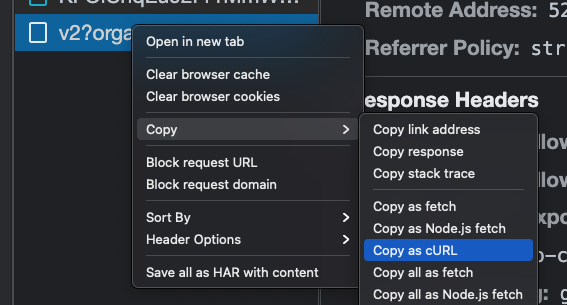

# Query Debugger

This repository is a tool to help debugging Coveo queries.

## Project plan

Documentation & Plan in this [Google Doc](https://docs.google.com/document/d/1Bozqq9q9dxG91MV863KBWhqCoeN2dKH0cDGvapb8Gts/edit).

## How to use

Starting from a V2 request, in Chrome's Network tab, copy the request using `Copy as cURL`:



Copy it in `input.txt`, then execute:

```
node index.js
```

The file `request.json` will have the request's data parsed properly in a nice JSON.

## Getting Pipelines

To get pipelines, you need an Admin token. Set your token in `data/api.key` before running `node index.js`.

The pipeline info will be in `data/pipelines.json`
